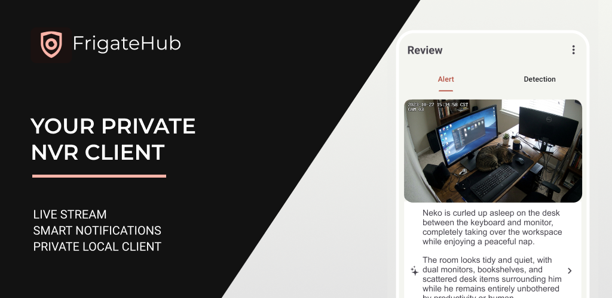
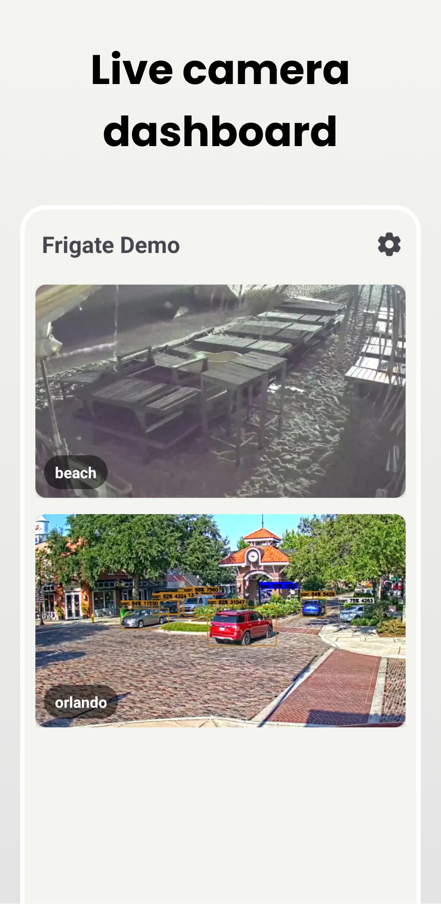
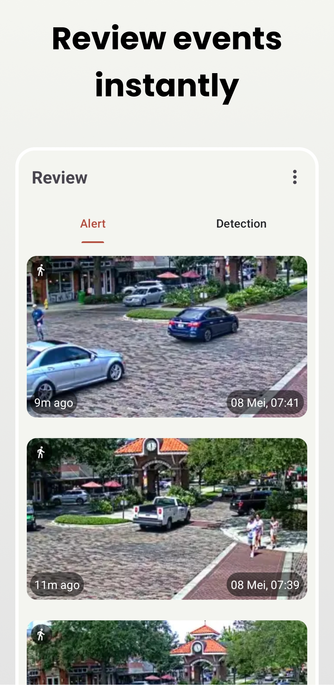
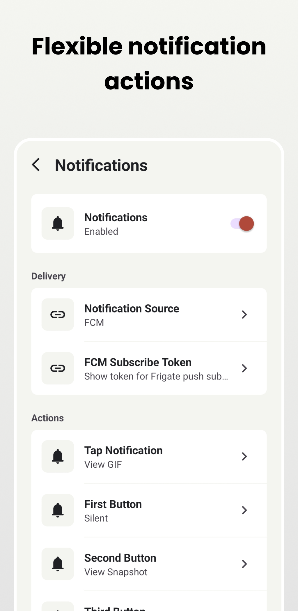
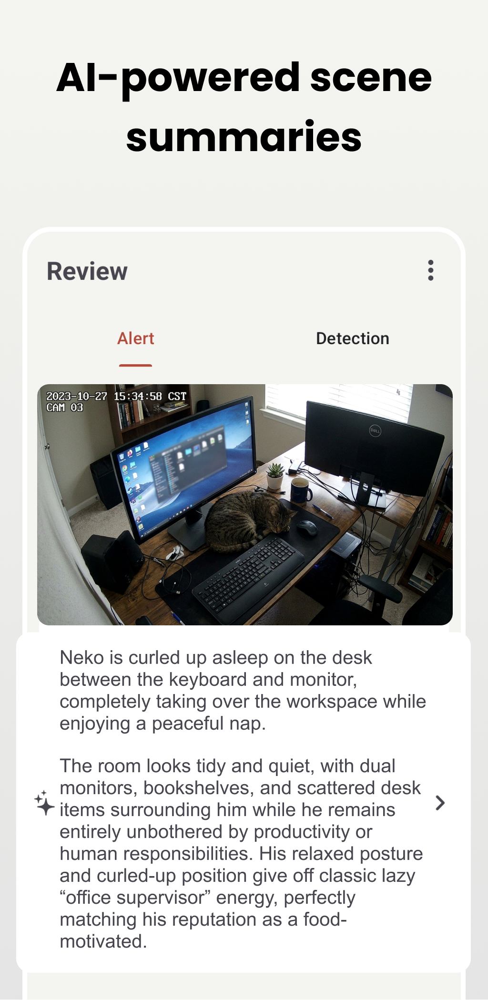
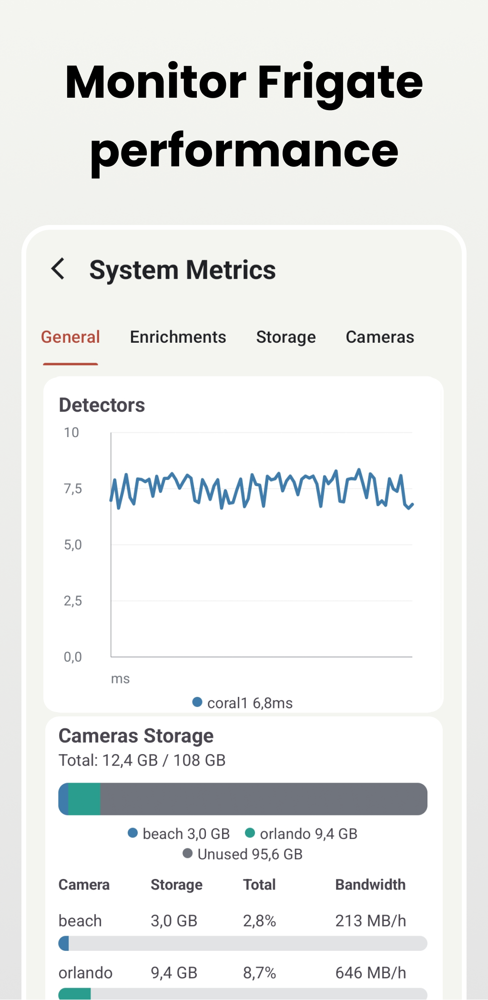
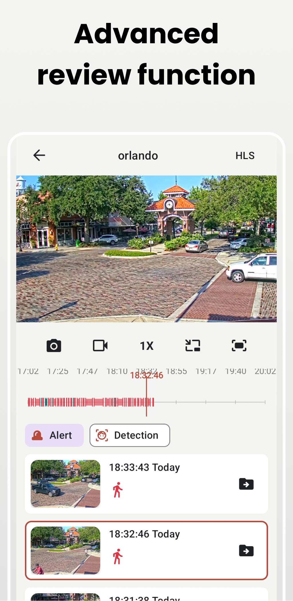

<p align="center">
  
</p>

# FrigateHub

FrigateHub is a native Android client for Frigate NVR servers. It is built with Kotlin and the Android Gradle Plugin, and focuses on fast camera viewing, review browsing, export access, and actionable notifications from your own Frigate instance.

The app stores connection details locally on the device and communicates only with the Frigate, MQTT, and notification services you configure.

## Download

<p>
  <a href="https://play.google.com/store/apps/details?id=me.ayra.frigate">
    
  </a>
</p>

## Features

- Connect to local or remote Frigate server URLs.
- Watch live camera streams with AndroidX Media3 and RTSP/HLS support.
- Browse review events, snapshots, GIF previews, clips, and object details.
- View and download Frigate exports.
- Manage camera rooms/groups when using an admin Frigate account.
- Register and view face recognition data.
- Use picture-in-picture playback for supported media.
- Configure MQTT or Firebase Cloud Messaging notifications.
- Open live streams, clips, snapshots, and GIF previews from notification actions.
- Silence notifications for selected cameras.
- Switch between local and public Frigate URLs based on Wi-Fi, VPN, or Ethernet state.
- Import, export, and reset app data.
- Manage multiple Frigate servers/accounts.

## Screenshots

<p align="center" width="100%">
  
  
  
  
  
  
</p>

## Notification Setup

FrigateHub supports two notification paths:

- MQTT directly from the Android app. This is local and direct, but a long-running MQTT listener may use more battery.
- Firebase Cloud Messaging through the companion automation server. This keeps notification delivery push-based and is the recommended path for most users.

To run the companion automation server:

```bash
cd automation-server
docker compose up -d --build
```

Open `http://localhost:5100`, sign in with the configured `ADMIN_PASSWORD`, and configure your Frigate MQTT settings, direct Frigate API base URL, FCM API URL, and FrigateHub FCM tokens.

See [Privacy Policy](https://ayra.eu.org/project/frigate/privacy_policy) for how app data, Frigate media, MQTT, and FCM notification data are handled.

## Roadmap

- [x] Phase 1: Project planning and setup
- [ ] Phase 2: Authentication and configuration
  - [x] Build login/config screen.
  - [x] Support multiple Frigate accounts.
  - [x] Validate login while connecting or saving account settings.
  - [x] Support local and public Frigate URLs.
  - [x] Switch local/public URLs based on Wi-Fi, VPN, or Ethernet state.
  - [ ] Move sensitive config to DataStore or EncryptedSharedPreferences.
- [x] Phase 3: Live camera view
  - [x] Display live camera streams with Media3/ExoPlayer.
  - [x] Support RTSP, HLS, and snapshot-compatible viewing paths.
  - [x] Show camera thumbnails from Frigate snapshot endpoints.
  - [x] Fetch camera list/config from Frigate APIs.
  - [x] Display cameras with RecyclerView and ViewPager2 room tabs.
  - [x] Open a player when a camera is selected.
  - [x] Add loading, refresh, and retry/re-login handling.
  - [x] Support motion overlays and motion event playback.
- [ ] Phase 4: Reviews, events, and media
  - [x] Show recent reviews/events.
  - [x] Open snapshots, clips, GIF previews, and live streams.
  - [x] Fetch events/reviews from Frigate APIs.
  - [x] Show authenticated thumbnails and media.
  - [x] View and download review clips.
  - [x] View and download Frigate exports.
  - [ ] Implement Android Paging for long lists.
- [ ] Phase 5: Background updates and alerts
  - [x] Firebase Cloud Messaging notification support.
  - [x] MQTT foreground notification service.
  - [x] Configurable notification actions.
  - [x] Per-camera notification silencing.
  - [x] System metrics/status screen.
  - [ ] Add a separate periodic background event polling mode.
- [ ] Phase 6: Settings and customization
  - [x] Manage app settings and camera preferences.
  - [x] Configure refresh rate, thumbnail height, dashboard grid, and quick review behavior.
  - [x] Manage camera rooms/groups with admin accounts.
  - [x] Import, export, and reset app data.
  - [x] Support light/dark themes through Android resource themes.
  - [ ] Add manual camera ordering.
- [ ] Phase 7: Testing and optimization
  - [ ] Add broader automated test coverage.
  - [ ] Validate RTSP/media performance across more network conditions.
  - [x] Handle expired sessions with re-login/retry paths.
  - [x] Show user-facing errors for server/API failures.
- [ ] Phase 8: Release
  - [x] Add GitHub documentation.
  - [x] Add launcher icon resources.
  - [ ] Publish release builds on GitHub.
  - [ ] Publish on Google Play.
  - [ ] Finalize release signing and public release notes.
- [ ] Optional enhancements
  - [ ] Chromecast support.
  - [ ] License plate recognition overlay UI.
  - [x] Face recognition layout and face registration.
  - [x] Frigate recording/review clip viewer with timeline.
  - [x] Explore/filter events by label and related details.
  - [x] Multiple Frigate account support.
  - [x] App data import/export.
